#Exploratory Data Analysis
##Variation
###1

```r
summary(select(diamonds, x, y, z))
```

```
##        x                y                z         
##  Min.   : 0.000   Min.   : 0.000   Min.   : 0.000  
##  1st Qu.: 4.710   1st Qu.: 4.720   1st Qu.: 2.910  
##  Median : 5.700   Median : 5.710   Median : 3.530  
##  Mean   : 5.731   Mean   : 5.735   Mean   : 3.539  
##  3rd Qu.: 6.540   3rd Qu.: 6.540   3rd Qu.: 4.040  
##  Max.   :10.740   Max.   :58.900   Max.   :31.800
```

```r
ggplot(diamonds) +
   geom_freqpoly(mapping = aes(x = x, color = "green"), binwidth = 0.1) +
   geom_freqpoly(mapping = aes(x = y, color = "blue"), binwidth = 0.1) +
   geom_freqpoly(mapping = aes(x = z, color = "yellow"), binwidth = 0.1)
```

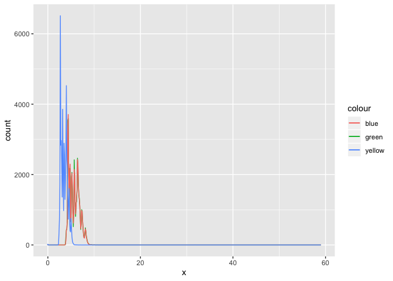<!-- -->


```r
ggplot(diamonds) +
  geom_point(aes(x=x, y=y))
```

<!-- -->
###2

```r
summary(select(diamonds, price))
```

```
##      price      
##  Min.   :  326  
##  1st Qu.:  950  
##  Median : 2401  
##  Mean   : 3933  
##  3rd Qu.: 5324  
##  Max.   :18823
```

```r
ggplot(diamonds) +
  geom_histogram(aes(x = price), binwidth = 5) +
  coord_cartesian(xlim = c(0, 2500))
```

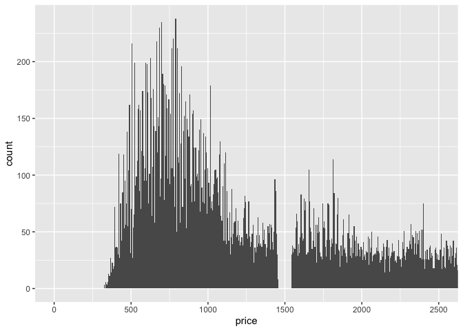<!-- -->
There is a gap.
###3

```r
tally(diamonds, carat == 0.99, TRUE)
```

```
## # A tibble: 1 x 1
##       n
##   <int>
## 1    23
```

```r
tally(diamonds, carat == 1, TRUE)
```

```
## # A tibble: 1 x 1
##       n
##   <int>
## 1  1558
```
###4

```r
ggplot(diamonds) +
  geom_histogram(aes(x = carat)) +
  coord_cartesian(xlim=c(0,3))
```

```
## `stat_bin()` using `bins = 30`. Pick better value with `binwidth`.
```

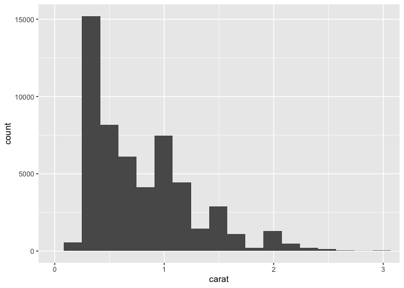<!-- -->

```r
ggplot(diamonds) +
  geom_histogram(aes(x = carat)) +
  xlim(c(0, 3))
```

```
## `stat_bin()` using `bins = 30`. Pick better value with `binwidth`.
```

```
## Warning: Removed 32 rows containing non-finite values (stat_bin).
```

```
## Warning: Removed 2 rows containing missing values (geom_bar).
```

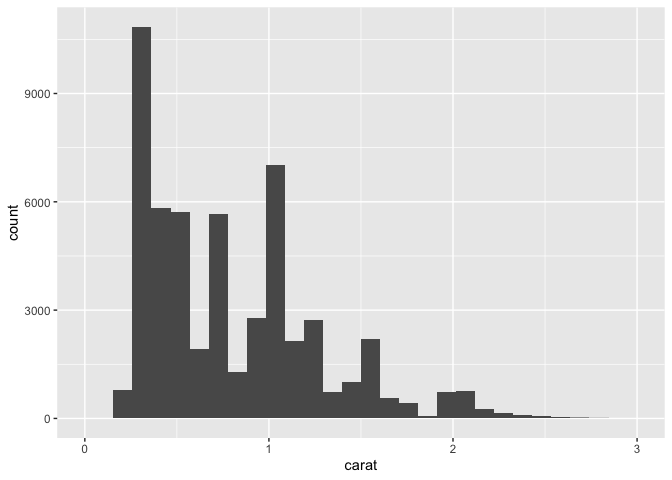<!-- -->
binwidth is different.

```r
ggplot(diamonds) +
  geom_histogram(aes(x = carat)) +
  coord_cartesian(ylim=c(0, 1000))
```

```
## `stat_bin()` using `bins = 30`. Pick better value with `binwidth`.
```

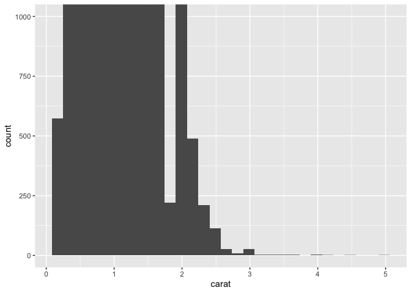<!-- -->

```r
ggplot(diamonds) +
  geom_histogram(aes(x = carat)) +
  ylim(c(0, 1000))
```

```
## `stat_bin()` using `bins = 30`. Pick better value with `binwidth`.
```

```
## Warning: Removed 10 rows containing missing values (geom_bar).
```

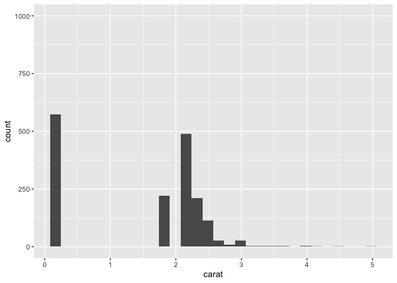<!-- -->
ylim() cuts off those exceeds 1000.

##Missing values
###1

```r
ggplot(flights) +
  geom_bar(aes(x = dep_time))
```

```
## Warning: Removed 8255 rows containing non-finite values (stat_count).
```

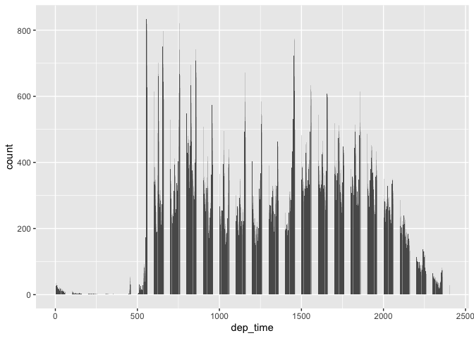<!-- -->

```r
ggplot(flights) +
  geom_histogram(aes(x = dep_time))
```

```
## `stat_bin()` using `bins = 30`. Pick better value with `binwidth`.
```

```
## Warning: Removed 8255 rows containing non-finite values (stat_bin).
```

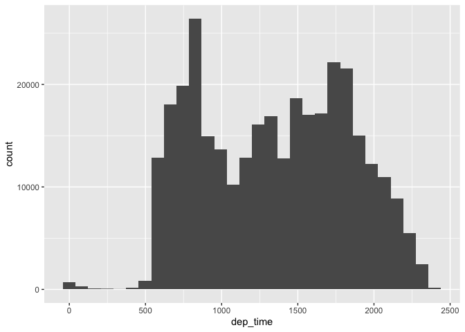<!-- -->

```r
ggplot(flights) +
  geom_histogram(aes(x = dep_time), binwidth = 1)
```

```
## Warning: Removed 8255 rows containing non-finite values (stat_bin).
```

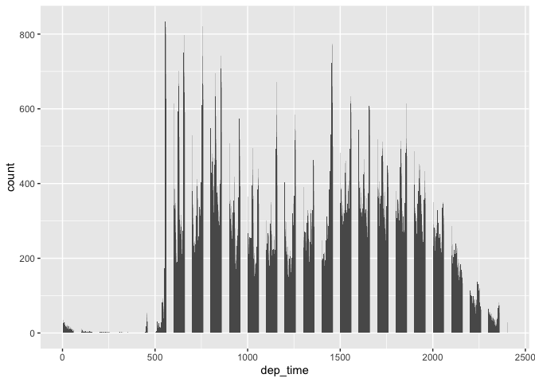<!-- -->
Histogram will give a warning that says "removed NA"
###2

```r
group_by(flights, dep_time) %>%
  count() %>%
  sum(na.rm = TRUE)
```

```
## [1] 1995334
```

```r
x <- flights$dep_time
mean(x, na.rm = TRUE)
```

```
## [1] 1349.11
```

##Covariation
###1

```r
flights %>%
  mutate(cancelled = is.na(dep_time)) %>%
  ggplot() +
  geom_boxplot(aes(x = cancelled, y = sched_dep_time))
```

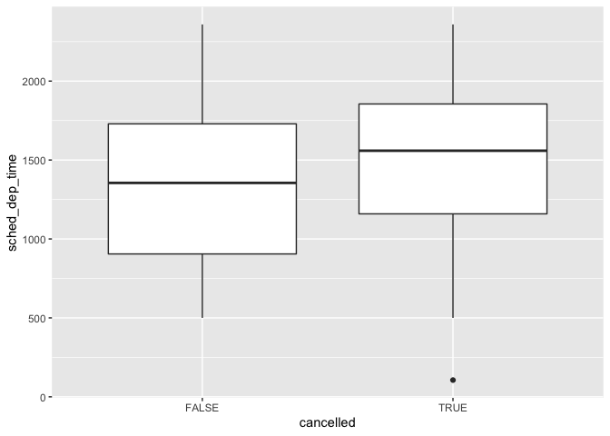<!-- -->
###2

```r
ggplot(diamonds) +
  geom_boxplot(aes(x = carat, y = price, group = cut_width(carat, 0.1))) 
```

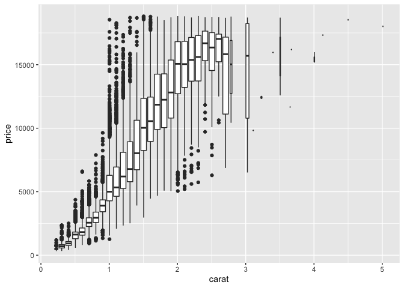<!-- -->

```r
ggplot(diamonds) +
  geom_boxplot(aes(x = fct_rev(clarity), y = price))
```

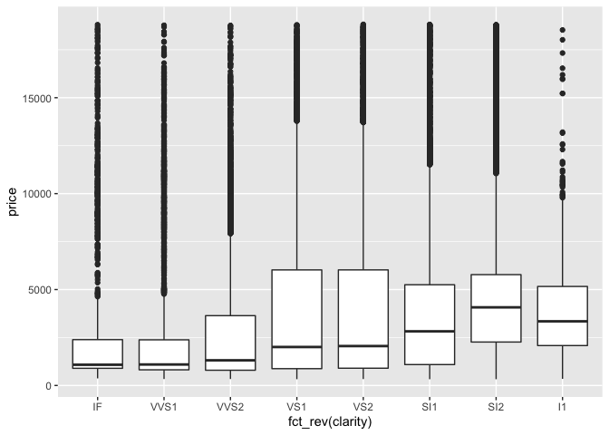<!-- -->

```r
ggplot(diamonds) +
  geom_boxplot(aes(x = fct_rev(cut), y = price))
```

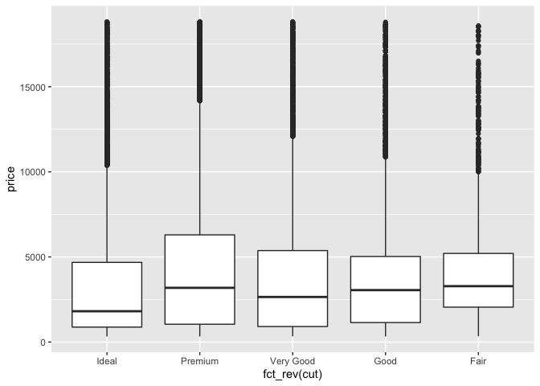<!-- -->
###3

```r
ggplot(mpg) +
  geom_boxplot(aes(x = reorder(class, hwy), y = hwy)) +
  coord_flip()
```

<!-- -->
geom_boxploth is the horizontal version.

```r
ggplot(mpg) +
  geom_boxploth(aes(y = reorder(class, hwy), x = hwy))
```

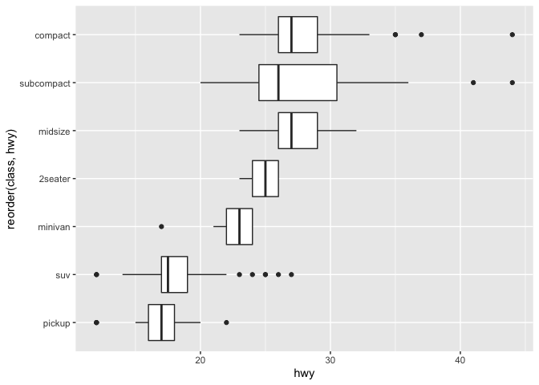<!-- -->
###4
letter value plot
more percentile presented

```r
ggplot(diamonds) +
  geom_lv(aes(x = fct_rev(cut), y = price))
```

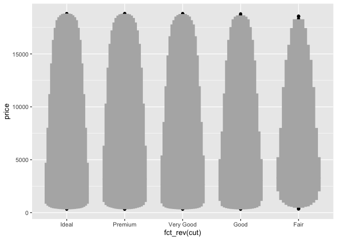<!-- -->
###5

```r
ggplot(diamonds,aes(x = price, y = ..density..)) +
  geom_freqpoly(mapping = aes(color = cut), binwidth = 500)
```

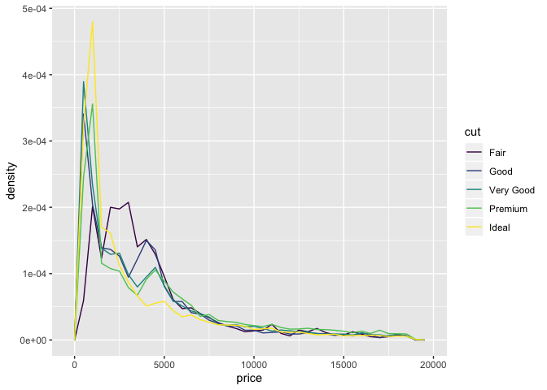<!-- -->

```r
ggplot(diamonds,aes(x = price)) +
  geom_histogram() +
    facet_wrap(~cut, ncol = 2)
```

```
## `stat_bin()` using `bins = 30`. Pick better value with `binwidth`.
```

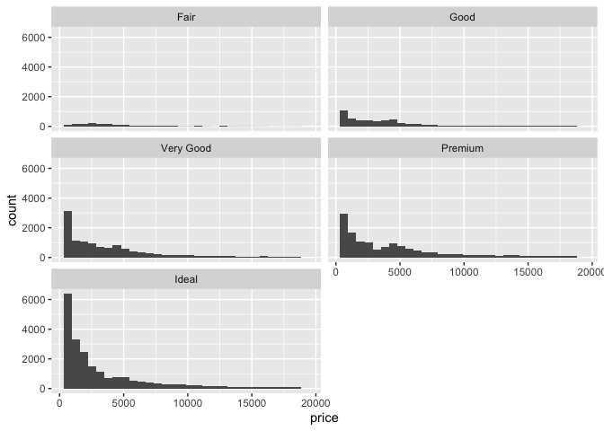<!-- -->

```r
ggplot(diamonds, aes(x = cut, y = price)) +
  geom_violin() +
  coord_flip()
```

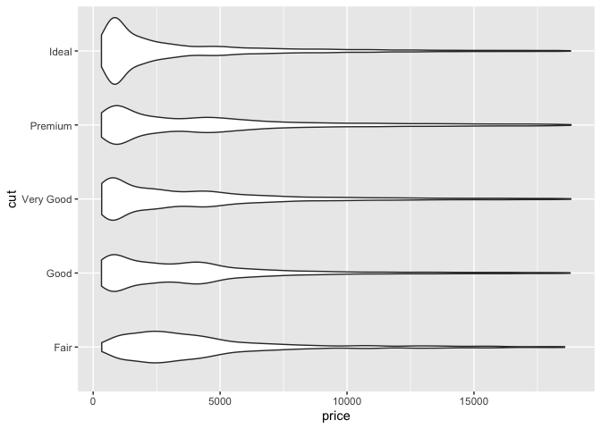<!-- -->
###6

```r
ggplot(mpg) +
  geom_jitter(aes(x = reorder(class, hwy), y = hwy)) 
```

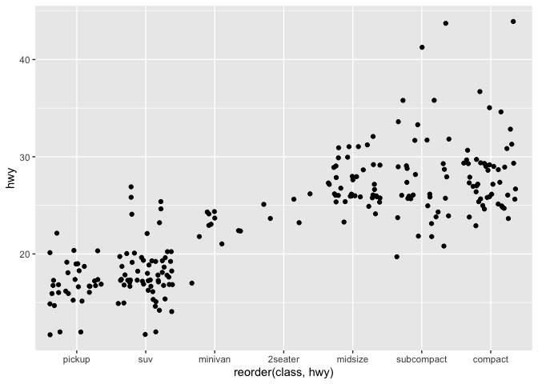<!-- -->

```r
ggplot(mpg) +
  geom_quasirandom(aes(x = reorder(class, hwy), y = hwy))
```

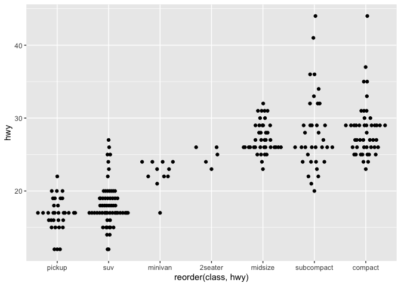<!-- -->

```r
ggplot(mpg) +
  geom_beeswarm(aes(x = reorder(class, hwy), y = hwy))
```

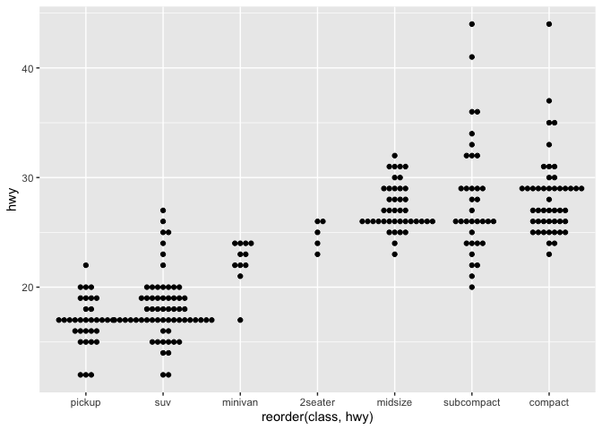<!-- -->
##Two categorical variables
###1

```r
diamonds %>%
  count(color, cut) %>%
  group_by(color) %>%
  mutate(prop = n / sum(n)) %>%
  ggplot(mapping = aes(x = color, y = cut)) +
  geom_tile(mapping = aes(fill = prop)) +
  scale_fill_viridis_c(limits = c(0, 1))
```

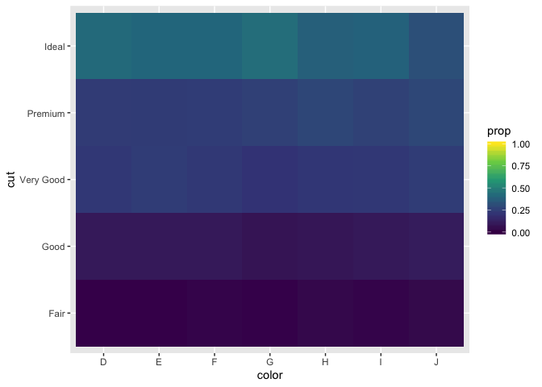<!-- -->

```r
diamonds %>%
  count(color, cut) %>%
  group_by(cut) %>%
  mutate(prop = n / sum(n)) %>%
  ggplot(mapping = aes(x = color, y = cut)) +
  geom_tile(mapping = aes(fill = prop)) +
  scale_fill_viridis_c(limits = c(0, 1))
```

<!-- -->
###2

```r
flights %>%
  group_by(month, dest) %>%
  summarise(dep_delay = mean(dep_delay, na.rm = TRUE)) %>%
  group_by(dest) %>%
  filter(n() == 12) %>%
  ungroup() %>%
  ggplot(aes(x = factor(month), y = dest, fill = dep_delay)) +
  geom_tile() +
  scale_fill_viridis_c()
```

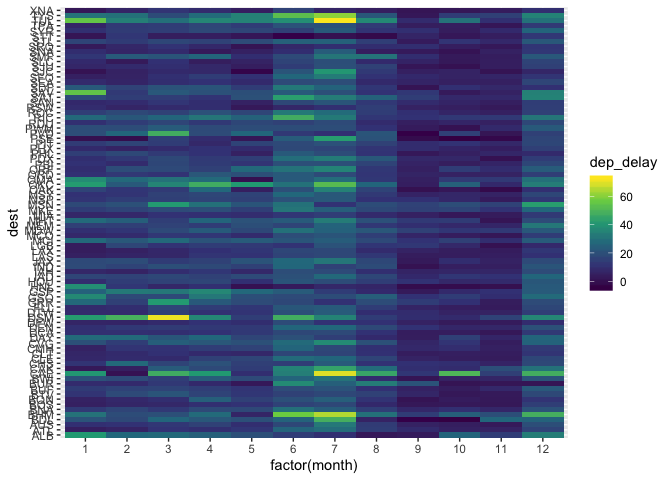<!-- -->
###3

```r
diamonds %>%
  count(color, cut) %>%
  group_by(color) %>%
  mutate(prop = n / sum(n)) %>%
  ggplot(mapping = aes(x = color, y = cut)) +
  geom_tile(mapping = aes(fill = prop)) +
  scale_fill_viridis_c(limits = c(0, 1))
```

<!-- -->

```r
diamonds %>%
  count(color, cut) %>%
  group_by(color) %>%
  mutate(prop = n / sum(n)) %>%
  ggplot(mapping = aes(x = cut, y = color)) +
  geom_tile(mapping = aes(fill = prop)) +
  scale_fill_viridis_c(limits = c(0, 1))
```

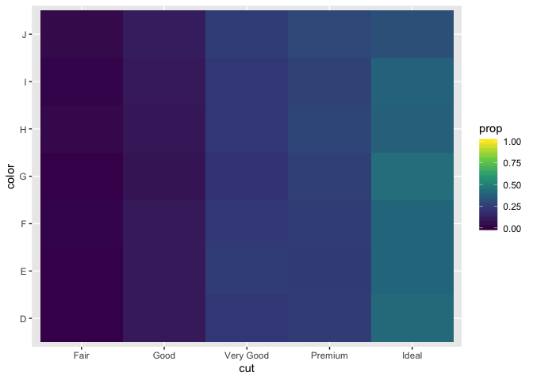<!-- -->
put the variable with more categories or longer labels on y-axis.

##Two continuous variables
###1
Both divides variable into bins; one defines bin width the other defines the number of bins

```r
ggplot(diamonds, aes(color = cut_number(carat, 5), x = price)) +
  geom_freqpoly() +
  labs(color = "Carat")
```

```
## `stat_bin()` using `bins = 30`. Pick better value with `binwidth`.
```

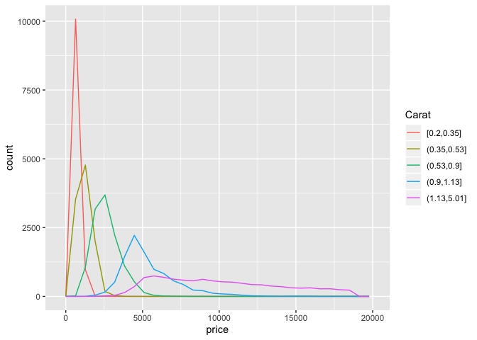<!-- -->

```r
ggplot(diamonds, aes(color = cut_width(carat, 1, boundary = 0), x = price)) +
  geom_freqpoly() +
  labs(color = "Carat")
```

```
## `stat_bin()` using `bins = 30`. Pick better value with `binwidth`.
```

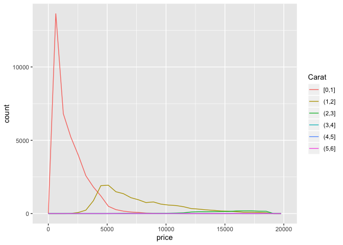<!-- -->
###2

```r
ggplot(diamonds, aes(x = cut_width(price, 2500), y = carat, boundary = 0)) +
  geom_boxplot() +
  coord_flip() +
  xlab("Price")
```

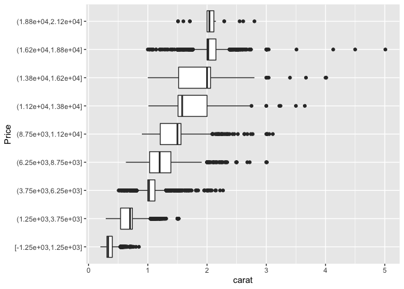<!-- -->
###3
It varies a lot...Not so surprising? Other properties such as clarity or cut might be important factors too.
###4

```r
ggplot(diamonds, aes(x = carat, y = cut)) +
  geom_tile(aes(fill = price)) +
  scale_fill_viridis_c() 
```

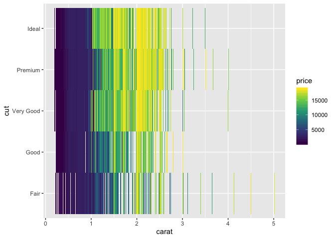<!-- -->
###5

```r
ggplot(data = diamonds) +
  geom_point(mapping = aes(x = x, y = y)) +
  coord_cartesian(xlim = c(4, 11), ylim = c(4, 11))
```

<!-- -->

```r
ggplot(diamonds, aes(x = x, y = y)) +
  geom_boxplot(aes(group = cut_width(x, 1)))
```

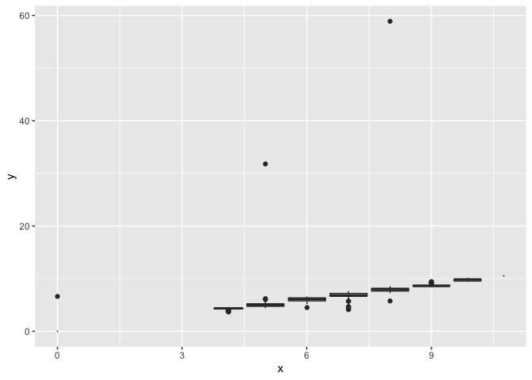<!-- -->
Because the strong linear relation between x and y is better visualized through scatterplot.
